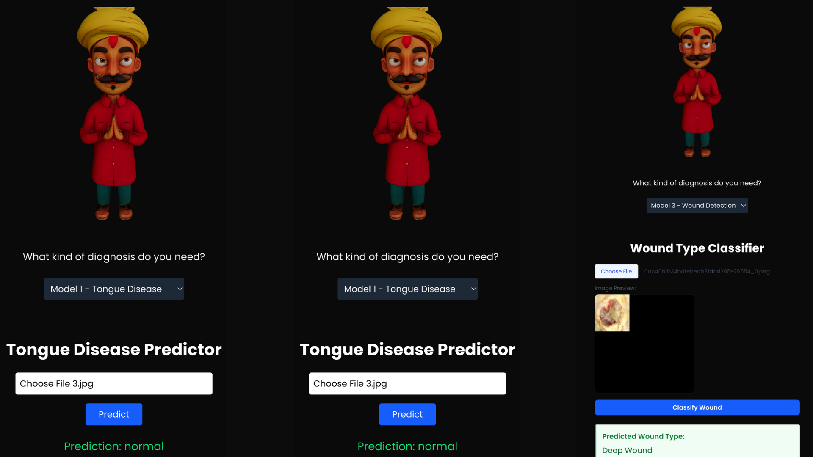
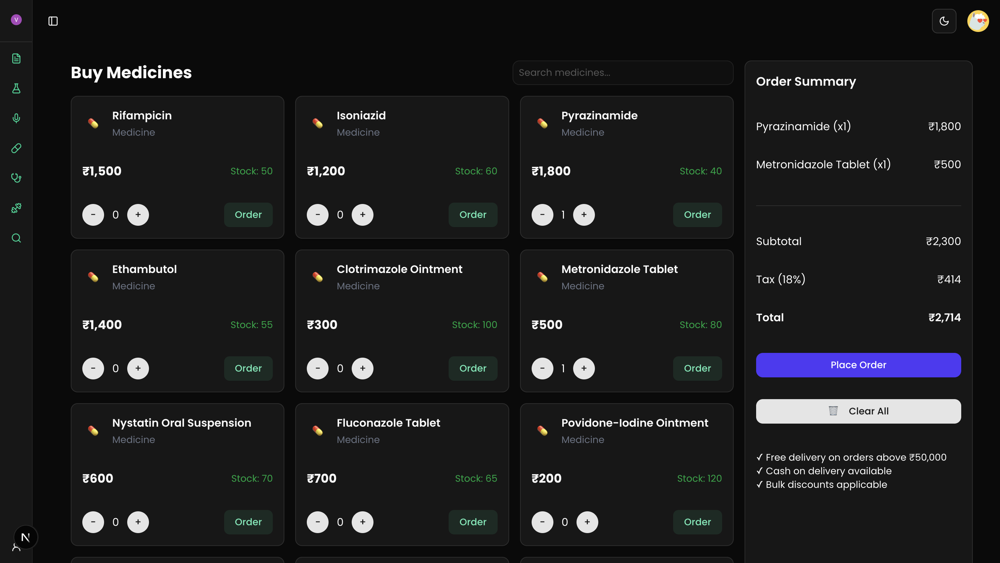

# MediConnect – Rural Clinics Connected to Urban Care via Smart Telehealth Platform  

**Hackathon**: Top 50 in IIT Delhi Hack4Health Hackathon by Horiba  
**Team Name**: CODE4CHANGE  

## 👥 Team Members
- Debshata Choudhury (Team Leader)  
- Abhishek Chaubhey  
- Niranjan Praveen 
- Vaibhav Jain   

**Contact**: [debshatachoudhury@gmail.com](mailto:debshatachoudhury@gmail.com)  
**Live Demo**: [Link to be added]  

---

## 🚀 Problem Statement
Rural healthcare in India faces a severe shortage of doctors, diagnostics, and infrastructure. With only 11 of 23 sanctioned doctor posts filled in Nabha Civil Hospital and limited internet penetration (31%), patients often face long travel for even minor issues. MediConnect empowers NGO-run rural clinics by connecting them digitally with urban doctors, diagnostic labs, and pharmacies—delivering affordable and smart healthcare with **AI triage, multilingual support, and offline-ready systems**.

---

## 🧠 Project Overview
MediConnect is a full-stack **rural health-tech bridge** that transforms basic patient visits into structured care journeys with AI and telemedicine.  

**Built for low-resource environments:**
- Telemedicine consultations  
- AI-powered triage & diagnostics  
- Smart e-prescriptions  
- Jan Aushadhi–based affordable medicine ordering  
- Personalized diet & fitness plans  
- Emergency escalation workflows  
- CSR-driven dashboards for funding transparency  

---

## ✨ Slide 1: Unique Innovations

1️⃣ **AI-Powered First-Line Diagnosis by Aasha Workers**  
Aasha workers record cough sounds and capture tongue/wound images. AI provides instant triage, reducing unnecessary hospital trips for **173 villages** and enabling early TB/skin disorder detection.  

2️⃣ **AI Saarthi – Local Language Health Guide**  
Converts medical findings into Punjabi/local dialects (text + voice). With only **31% internet penetration**, its *offline-ready guidance* ensures trust and compliance even in low-literacy communities.  

3️⃣ **Multilingual Telemedicine Platform**  
Patients consult city doctors in real-time video calls across multiple languages, bridging doctor shortages (11 vs 23 sanctioned posts in Nabha Civil Hospital).  

4️⃣ **Offline Digital Health Records**  
Health histories, prescriptions, and diagnostic reports work **offline-first**, syncing automatically once connected.  

5️⃣ **Real-Time Medicine Availability Tracking**  
Prevents wasted pharmacy visits by showing **live stock updates and alternatives**, ensuring faster treatment.  

6️⃣ **CSR-Funded Local Clinics & Aasha Marketplace**  
Transparent system for CSR-backed rural micro-clinics and medicine distribution, ensuring **sustainable last-mile care delivery**.  

---

## 🧩 Core Features

- **Real-Time Teleconsultation**  
    
  Secure video/audio consultations with doctors, coordinated by NGO staff, optimized for low bandwidth.  

- **Smart Diagnostic Triaging**  
    
  AI symptom clustering prioritizes severity and suggests relevant tests/referrals.  

- **Minimal-Data e-Prescription Engine**  
    
  Converts vitals and history into AI-assisted prescriptions and personalized care plans.  

- **Jan Aushadhi Medicine Ordering**  
    
  Connects clinics to affordable medicines from government-run or trusted vendors.  

- **Health Data Tracker**  
  Longitudinal patient medical history with minimal digital overhead.  

- **Role-Based Access Control**  
  - NGO staff: Vitals & history collection  
  - Doctors: Consultations & prescriptions  
  - Labs: Diagnostics referrals  
  - CSR/Admin: Analytics dashboards  

- **Patient Records Management**  
    
  Search/filter records, view history, and manage logs.  

- **Fitness Plan Generator**  
    
  Generate *custom meal & exercise plans*.  

- **Live Conversation Capture**  
  Supports multilingual voice/text for consults with "Start Now" button.  

---

## 👥 User Roles
- **Clinic Assistant** – Collects patient data, organizes consultations.  
- **Doctor** – Provides care and validates AI suggestions.  
- **Lab Partner** – Handles test referrals.  
- **CSR/Admin** – Monitors outcomes, funds operations.  

---

## ☁️ AI & Cloud Integration
- **LLM-Powered Prescriptions** – AI-driven structured care.  
- **Symptom Triager** – Maps symptoms → relevant diagnostics.  
- **Feedback Loop** – Continuous model improvement with real cases.  

---

## 🧰 Technology Stack
- **Frontend**: Next.js, Tailwind, ShadCN UI, Three.js, Magic UI  
- **Backend**: Flask  
- **Database**: Supabase  
- **APIs**: Gemini API  
- **Auth**: KindeAuth  
- **Deployment**: Vercel (frontend), Render (backend)  

---

## 💻 How to Run

git clone https://github.com/YourOrg/medi-connect.git
cd medi-connect

Frontend
cd client
npm install
npm run dev

Backend
cd ../server
npm install
npm start

Access at
http://localhost:3000

## 📊 Slide 4: Feasibility, Viability, Challenges

### Feasibility
- AI models (cough, tongue, wound) lightweight for rural devices.  
- Regional AI Saarthi ensures adoption in low-literacy areas.  
- Offline-first ensures records despite low connectivity.  
- Uses existing Aasha worker network = no extra workforce.  

### Viability
- CSR-backed clinics = patient cost-free model.  
- Telemedicine in India growing at **31% CAGR (2020–2025)**.  
- Regional guidance improves compliance + trust.  
- AI triage reduces hospital load → favored by state health departments.  

### Challenges
- Accuracy of rural diagnosis AI requires dataset refinements.  
- Dialect variations may challenge AI Saarthi adoption.  
- Poor network still affects real-time consultations.  
- Compliance with **NDHM/HIPAA** critical for trust.  

### USP
- Regional voice-based AI Saarthi unique to MediConnect.  
- First-line AI triage empowers Aasha workers instantly.  
- Live pharmacy stock-check solves recurring **medicine stock-outs**.  
- CSR-backed sustainability differentiates MediConnect from other apps.  

### Use Cases
- AI triage for TB, tongue, and skin conditions via Aasha workers.  
- AI Saarthi voice/text guidance in local language.  
- Rural patients connect with urban specialists through telemedicine.  
- CSR-backed rural clinics with **real-time stock visibility**.  

### Business Potential
- Replicable **rural healthcare model** (covering 65% of India’s population).  
- Huge market via **₹25,000 Cr CSR healthcare annual spend**.  
- Partnership opportunities: state govts, NGOs, pharma.  
- Long-term revenue via telemedicine, CSR clinics, pharmacy integration.  

---

## 🌍 Slide 5: Impact Benefits

### Social Benefits
- Regional language health education → builds trust.  
- AI triage ensures early interventions in **villages across Nabha**.  
- Telemedicine bridges massive doctor shortages.  

### Economic Benefits
- Saves daily wage workers from **income losses**.  
- CSR funding ensures **no patient burden**.  
- Real-time pharmacy visibility boosts local pharmacy revenues.  

### Technological Benefits
- Offline-first ensures reliability at only 31% net penetration.  
- Lightweight AI models → run on low-resource devices.  
- Hybrid AI + doctor approvals ensure both accuracy and trust.  

### Environmental Benefits
- Reduced carbon footprint by minimizing hospital travel.  
- Digital records → less paper usage.  
- Decentralized clinics decongest city hospitals.  

---

## 🎯 Impact on Target Audience
- **Rural Patients & Daily-Wage Earners**: Prevent long hospital trips, save wages, ensure quick care via Aasha + telemedicine.  
- **Healthcare Ecosystem in Nabha**: Fixes doctor shortages, ensures medicine availability, builds community trust via AI Saarthi, improving rural healthcare outcomes at scale.  

---

## 💰 Scalability & Business Model
- **CSR-driven Rural Healthcare** under Section 135 of Companies Act.  
- **Revenue Streams**:  
  - Doctor consultation commissions  
  - Diagnostic referrals  
  - Medicine ordering affiliates  
  - SaaS for NGOs  
  - CSR analytics dashboards  

---

## 🧱 Modular Architecture
- Offline-first design.  
- Multilingual UI (Hindi, Punjabi, English, Marathi).  
- Expandable into mental health, maternal, and chronic care.  
- Seamless integration with PHC/state health systems.  

---

## 📌 Summary
**MediConnect = Smart, AI-powered rural healthcare for India.**  
By combining **AI triage**, **multilingual Saarthi guidance**, **telemedicine**, **CSR micro-clinics**, and **real-time pharmacy visibility**, MediConnect delivers inclusive, scalable, and affordable healthcare where it is needed most.  

**Let’s connect care—digitally.**

