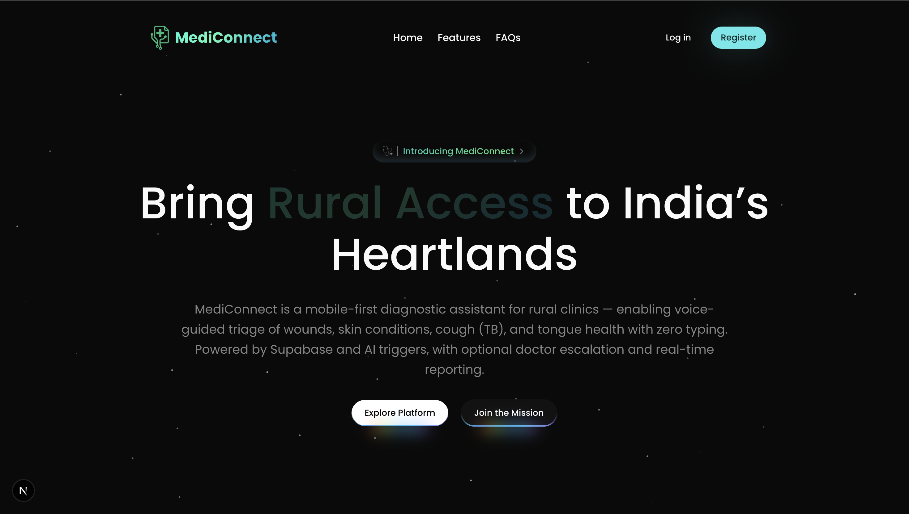

# MediConnect – Rural Clinics Connected to Urban Care via Smart Telehealth Platform

**Hackathon**: Hack4Health  
**Team Name**: CODE4CHANGE

## Team Members

- Vaibhav Jain (Team Leader)  
- Abhishek Chaubhey  
- Debshata Choudhury  
- Niranjan Praveen  

**Contact**: vaibavjain62@gmail.com  
**Live Demo**: *[Link to be added]*

---

## 🚀 Problem Statement

Rural healthcare in India suffers from a severe shortage of specialists, diagnostics, and care infrastructure. **MediConnect** aims to empower NGO-run village clinics by digitally connecting them to verified city doctors, diagnostic labs, and medicine providers—delivering smart, affordable care powered by real-time consultations and minimal-data diagnostics.

---

## 🧠 Project Overview

**MediConnect** is a full-stack rural health-tech platform that acts as a digital bridge between villagers and qualified urban healthcare providers. It transforms basic patient data into actionable, AI-guided care flows—teleconsultations, prescriptions, lab referrals, and medicine ordering.

  
  
  
  


### Built for low-resource environments:

- Telemedicine consultations  
- Smart e-prescriptions  
- Diagnostic lab referrals  
- Jan Aushadhi–based medicine ordering  
- Personalized diet and care plans  
- Emergency escalation  
- CSR health analytics dashboards

---

## 🧩 Core Features

### Real-Time Teleconsultation
Secure video/audio consultations between patients and doctors, coordinated by NGO clinic staff.

### Minimal-Data e-Prescription Engine
Converts basic symptoms, vitals, and history into structured prescriptions and personalized care plans.

### Smart Diagnostic Triaging
AI models suggest relevant lab tests or specialist referrals based on symptom clustering and severity prioritization.

### Jan Aushadhi Medicine Ordering
Integrated ordering from low-cost government pharmacies or verified local vendors.

### Emergency Case Transfer
Single-click escalation to nearby government facilities with digital referral documentation.

### Health Data Tracker
Maintains longitudinal care records for patients with minimal digital overhead.

### Role-Based Access Control
User-specific permissions for:
- NGO clinic staff
- Doctors
- Lab partners
- CSR funders/admins

---

## 👥 User Roles

- **Clinic Assistant** – Captures vitals, patient history, and connects with doctors  
- **Doctor** – Conducts consults, approves prescriptions  
- **Lab Partner** – Receives diagnostic referrals  
- **CSR/Admin Partner** – Monitors care delivery and funds operations

---

## ☁️ AI & Cloud Integration

- **LLM-Powered Prescriptions** – Leverages LLMs to recommend treatment based on input data  
- **Symptom Triager** – Maps symptoms to diagnostic tests using AI clustering  
- **Feedback Loop** – Continuously improves via real-world feedback and data outcomes

---

## 🧰 Technology Stack

- **Frontend**: Next.js, Tailwind CSS, ShadCN UI, Three.js, Magic UI  
- **Backend**: Flask  
- **Database**: Supabase  
- **APIs**: Gemini API  
- **Authentication**: KindeAuth  
- **Deployment**: Vercel (Frontend), Render (Backend)

---

## 💻 Code Execution Instructions

### 1. Clone the Repository

```bash
git clone https://github.com/YourOrg/medi-connect.git
cd medi-connect
```

### 2. Install Frontend Dependencies

```bash
cd client
npm install
```

### 3. Install Backend Dependencies

```bash
cd ../server
npm install
```

### 4. Start Development Servers

#### Frontend

```bash
cd client
npm run dev
```

#### Backend

```bash
cd ../server
npm start
```

### 5. Access the Application

Open your browser and go to:  
`http://localhost:3000`

---

## 💰 Scalability & Business Model

### CSR-Funded Healthcare Delivery

- Leverages Section 135 of the Indian Companies Act for CSR healthcare projects  
- Corporate partners fund digital infrastructure and subsidize care delivery

### Revenue Streams

- Consultation commissions  
- Diagnostic test referral margins  
- Affiliate income from medicine ordering  
- NGO SaaS subscription fees  
- CSR impact analytics dashboards

---

## 🧱 Modular Architecture

- Offline-first design  
- Multilingual UI (Hindi, English, Marathi)  
- Seamless PHC/Government system integration  
- Expandable to mental health, maternal care, chronic diseases

---

## 📌 Summary

**MediConnect** delivers smart diagnostics and structured care to rural India by connecting NGO-operated clinics with urban healthcare providers. It maximizes clinical value through minimal data, AI-powered tools, and low-bandwidth infrastructure—creating a scalable, inclusive health ecosystem.

Aligned with the **Hack4Health** theme of **Smart Diagnostics With Minimal Data**, MediConnect is built to democratize healthcare access for underserved populations.

---

**Let’s connect care—digitally.**
